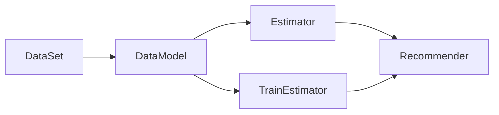

# IP상품 추천 (IPIRec, IP items recommender)

## I. 분석모델
요약:
- 태그를 기준으로 앱 사용자들의 의사결정 내역을 분석해서, 통합항목(상품 또는 게시글)들에 대한 선호정도를 추정합니다.
    - 태그들 간의 관계 $S$, 태그들에 대한 사용자들의 성향 $\Omega$를 구합니다.
    - 앞서 구한 $S, \Omega$를 사용해, 사용자 $u$의 항목 $i$에 대한 선호정도 $\hat{r}(u,i)$를 0에서 1사이로 추정합니다.
- 예측으로 20%이상의 검색량과 1%이상의 정확성($f_{1}$-score $\geq 0.1$)을 보이는 것이 개인 목표였음
    - 목표 달성시, 항목들의 수요량 추정(예측)하는 것을 후속연구로 구상했고,
    - 그 다음 단계에서, 임의의 태그조합으로 가상의 항목을 만들고, 이에 대한 수요량을 추정하는 연구를 계획했음.
        - 수요량 추정은 평가척도 값의 기준 달성여부로 적합성을 평가한 후, AB-test를 통해 모델의 적합성평가/개선/고도화할 예정이었음.
        - 태그조합의 단서, 여기에 속하는 항목들의 집합을 선별요약해서 유행분석/디자인생성모델과의 연계가 이 모듈의 활용안이었음.

## II. 설계 및 활용계획

### 구상

- 주어진 데이터를 2차원 태그관계 행렬에 구하는 것이 핵심.
    - 전반적인 태그분포는 $S$,
    - 사용자들의 태그성향은 $\Omega$에 구함 -- 의사결정 중심
- $S$의 초기 값은 발생빈도 중심으로 채우고 보정하지만(전처리), 주 단계부터는 $\Omega$를 최소화하도록 $S\Omega$로 보정하는 것이 풀이방법임
- 태그관계로 선호를 잘 맞추면, 상품 수요량 추정으로 확장하고자 함
- (상품 수요량을 잘 맞춘다는 것을 전제로) 미래의 상품판매량을 예측하고자 함
    - (태그들의 조합으로)임의의 항목들을 추가해서, 사용자들에게 추천된 양으로 수요량을 추정하는 것임
    - 필요하다면 구매할 것으로 추천된 항목들의 태그관계도 관찰해보기도 하고,

### 방법론 -- 태그관계 계산(보정)과정

#### 의사결정 종류별 특성

- 봤다: 이런 태그 조합이 유효하다.
- 좋다: 이런 태그 조합이 적합하다.
- 샀다: 이 조합에서 구매욕이 있다.

#### 의사결정 종류별 특성을 감안해, VLP순으로 태그점수를 찾고자 함

1. 주어진 데이터에서 태그발생 분포를 구합니다.
2. `봤다`분포로 조금씩 변경합니다.
    - 이런 태그조합으로 상품화 됨을 태그관계에 반영합니다.
3. `좋다`분포로 조금씩 변경합니다.
    - 이런 태그조합에 사람들이 관심가짐을 태그관계에 반영합니다.
    - 반대로, 여기에 속하는 항목들을 요약해 관찰해야 합니다.
4. `샀다`분포로 조금씩 변경합니다.
    - 이런 태그조합에 사람들의 구매전환이 이뤄짐을 태그관계에 반영합니다.
    - 마찬가지로, 여기에 속하는 항목들을 요약해 관찰해야 합니다.

#### 일반화, 개인화

- 태그관계 $S$에 사용자들의 성향 $\Omega$를 반영하는 개인화가 필요합니다.
- $S$와 $\Omega$로 주어진 데이터 특성을 표현해 관찰하고자 현 구조로 설계했습니다.
- 개인화는 두 행렬의 곱으로 얻습니다:

    $$W(u) = S \cdot \Omega(u)$$

### 세부목표 - 검색량

- 태그관계 정답지가 없으니, 이를 사용한 예측오차를 기준으로, 태그점수의 적합성을 평가하고자 했습니다.
    - 태그점수로 예측한 오차가 기존 연구모델의 오차수준이면 적합
- `1개 맞춘 것에서의 오차`와 `100개 맞춘 것에서의 오차`는 다름
    - 현 시점에선 1개 맞추는 수준임
    - 검색량(많이 맞추는 것)부터 높여야 함
    - 최소한 20%이상의 검색량을 전제로 오차감소, 순서화에 의미가 있음

## III. 패키지 구성

### 기본구성 모듈 및 실험용 데이터 구성모듈

- [Core](core/README.md): 추상화
    - 분석모델 기능구현에 관한 추상모듈들
- [Refine](refine/README.md): 데이터 정제
    - 실험용 데이터 셋 구성 기능구현에 관한 모듈들
- [Colley](colley/README.md): 자사 데이터 명세
    - 자사 데이터의 명확한 명세 또는 처리관련 기능구현 모듈들로 구성됩니다.
- [MovieLens](movielens/README.md): 공개 데이터 명세
    - 공개 데이터의 명확한 명세 또는 처리관련 기능구현 모듈들로 구성됩니다.
- [Resources](resources/README.md): 분석에 필요한 자원, 분석과정들이 저장됩니다.
    - 파일 저장소입니다.

### 비교모델 구성모듈

- [ItemCF (IBCF, Item-based collaborative filtering)](itemcf/README.md): 비교모델
    - 항목기반 협업 필터링 기능구현에 관한 모듈들로 구성됩니다.
    1. 항목들 간의 유사도를 구한다.
    2. 사용자가 의사결정 했던 항목들과의 유사도로 상품들의 선호정도를 예측한다.
    3. 선호정도가 높은 항목들을 추천한다.
- [Decompositions (NMF, Non-negative matrix factorization)](decompositions/README.md): 비교모델
    - 행렬분해를 사용한 협업 필터링 기능구현에 관한 모듈들로 구성됩니다.
    1. 의사결정 행렬을 인수 분해기로 몇 개의 축소된 행렬들에 특성들을 표현한다(representation).
        - 비음수 행렬분해만 재현했기에, 두 개의 차원 축소 행렬을 얻습니다.
    2. 원본 행렬을 잘 맞추도록 보정한다(low-rank approximation).
    3. 사용자가 의사결정 하지 않았던 항목들의 선호정도를 예측한다.
    4. 선호정도가 높은 항목들을 추천한다.

### 제안모델 구성모듈

- [IPIRec](ipirec/README.md): 제안모델
    - 태그관계 분석을 통한 IP상품 추천 기능구현에 관한 모듈들

### 관측용 모듈

- [IPynb](ipynb/README.md): 분석모델 관측(관계관찰 및 오류확인)을 목적으로 하는 모듈들
    - 모델/모듈에 속한 변수들을 관찰합니다.
    - 저장소에는 분석결과들을 관찰하기 위한 모듈들로만 구성됩니다. 

## IV. 분석모델 만들기 (분석모듈 조립)
요약:
- 분석모델은 DataSet, Model, Estimator 모듈들을 조합해 만듭니다.

- 새로운 분석 모델(또는 모듈)의 구현은 전담기능을 고려해 상속(재정의)하면 됩니다.
    - 데이터 재처리 목적이면 DataSet을 재정의 하세요.
    - 새로운 모델훈련은 BaseTrain을 상속해 재정의 하세요.

- 실험용 모델구성 및 결과들은 [Experiments](./experiments/README.md)를 참고하세요.

<!-- 
### A. 비교모델: `Experiments/Related`에 구현됨.
- IBCF: [분석모델](experiments/related/ibcf.py), [성능평가](experiments/related/run_ibcf.sh), [결과요약](experiments/related/ibcf_results_summary.py)
- NMF: [분석모델](experiments/related/nmf.py), [성능평가](experiments/related/run_nmf.sh), [결과요약](experiments/related/nmf_results_summary.py)

### B. 제안모델: `Experiments/Our`에 구현됨.
- IPIRec(Rev1): [분석모델](experiments/our/rev1.py), [성능평가](experiments/our/run_rev1.sh), [결과요약](experiments/our/rev1_results_summary.py)
- IPIRec(Rev2): [분석모델](experiments/our/rev2.py), [성능평가](experiments/our/run_rev2.sh), [결과요약](experiments/our/rev2_results_summary.py)
- IPIRec(Rev3): 여러 측면에서 나쁜 성능결과를 보여 파기됐습니다. 
- IPIRec(Rev4): [분석모델](experiments/our/rev4.py), [성능평가](experiments/our/run_rev4.sh), 결과요약은 [이 코드](experiments/our/results_summary.py)를 수정해서 사용하세요.
- IPIRec(Rev4Ver1): [분석모델](experiments/our/rev4v1.py), [성능평가](experiments/our/run_rev4ver1.sh), 결과요약은 위와 같습니다.

-->

## V. 부록

[실행환경 만들기](./assets/README.md)

[데이터 셋 만들기 예제](./ipynb/const_models_ex/dataset_creation.ipynb)

[분석모듈 만들기 예제](./ipynb/const_models_ex/ipirec_rev4_model.ipynb)

<!--
태그관계 관찰
- 첫번째 교차검증 데이터 셋에서, IPIRec(Rev4)로 구해진 사용자들의 태그관계 비교
    - user_id = 220472
        

    - user_id = 745701
        

    - user_id = 764602
        

    - user_id = 774879
        
-->
