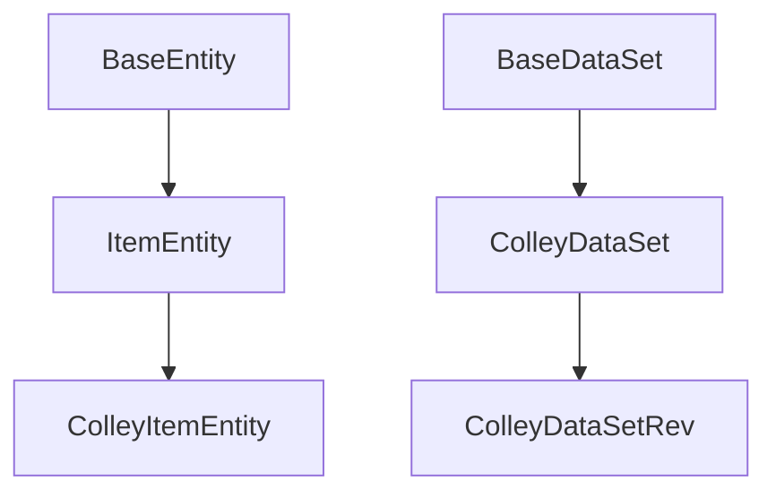

# Colley 

- [ColleyItemEntity(ItemEntity)](./entity/colley_item_entity.py)
    - 통합항목의 내용들을 다루는 기능구현을 위해 구성됐지만, 현재 사용하지 않습니다.
- [ColleyDataSet(BaseDataSet)](./dataset/colley_dataset.py)
    - 자사 데이터를 읽고 객체들의 관계표현 기능이 구현된 모듈입니다.
- [ColleyDataSetRev(ColleyDataSet)](./dataset/colley_dataset_rev.py)
    - 데이터 셋 구성모듈을 개정하면서, ColleyDataSet의 일부 기능들이 재정의 됐습니다.