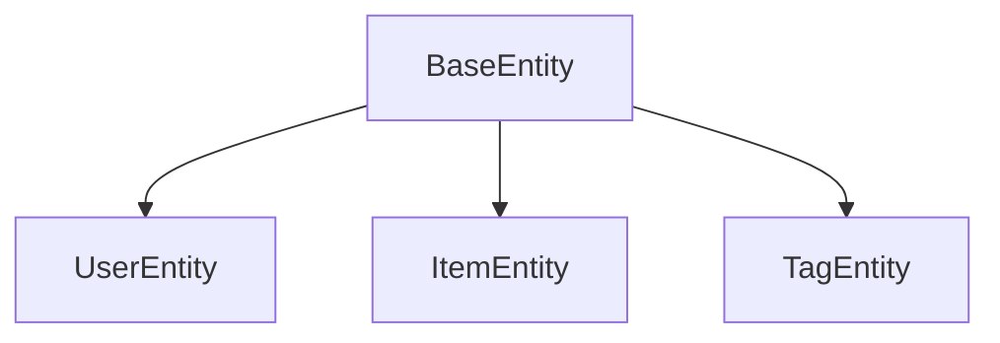
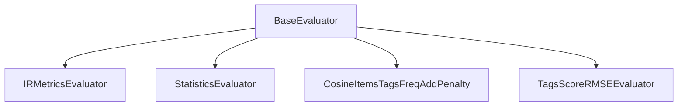
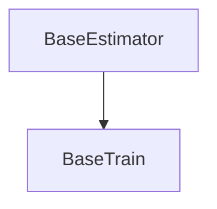
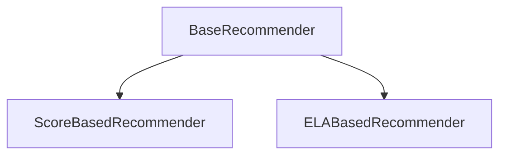

## Core
- 분석모델의 추상화에 사용되는 모듈들입니다. 


### defines: 
정의된 열거자들의 집합이고, 열거자들의 원소 어미는 `E_`로 시작합니다.
- [DataType](./defines/data_type.py): 데이터 종류입니다. 영화데이터와 자사데이터 선택지가 있을 때 사용됐고, 현재는 사용하지 않습니다.
    - DataType.E_MOVIELENS
    - DataType.E_COLLEY
- [DecisionType](./defines/decision_type.py): 의사결정 종류입니다. 봤다, 좋다, 샀다에 대한 선택지입니다.
    - DecisionType.E_VIEW: 봤다
    - DecisionType.E_LIKE: 좋아요
    - DecisionType.E_PURCHASE: 구매했다
- [Machine](./defines/machine.py): 실행환경을 선택합니다. AWS, 3090, 업무용 노트북에 대한 선택지입니다.
    - Machine.E_AWS
    - Machine.E_3090
    - Machine.E_MAC

### entity: 
의사결정 관계표현에 사용되는 추상 클래스들입니다.



- [BaseEntity](./entity/base_entity.py): 객체표현을 위한 추상 클래스입니다.
    - _parse_entity_(iter: pandas.iterrows): iter를 클래스 인스턴스로 변환합니다.
    - _load_collection_(file_path: str) -> dict: 객체 인스턴스 집합에 대한 사전을 반환합니다.
        - Key: id (int), Value: inst (Entity)
- [BaseAction](./entity/base_action.py): 의사결정 내역 객체
    - user_id, item_id, created_time
- [UserEntity(BaseEntity)](./entity/user_entity.py): 사용자 객체
    - user_id, user_index, interest_tags_set, $\cdots$
- [ItemEntity(BaseEntity)](./entity/item_entity.py): 통합항목 객체
    - item_id, item_index, tags_set, decisioned_users_dict, $\cdots$
- [TagEntity(BaseEntity)](./entity/tag_entity.py): 태그 객체
    - tag_name, tag_index, user_ids_set, item_ids_set, $\cdots$

### eval: 
성능평가에 사용되는 모듈들입니다.



- [IRMetricsEvaluator](./eval/ir_metrics_evaluator.py): 정보 검색 평가척도들을 구합니다.
    - precision, recall, $f_{1}$-score, $\cdots$

| confusion <br/> matrix | retrieval | non-retrieval |
|--:|:--:|:--:|
| relevant         | $tp$      | $fn$          |
| irrelevant       | $fp$      | $tn$          |

<!--
        |||predicted |||
        |--:|--:|:--:|:--:|:--:|
        |||retrieval|non-retrieval|
        |actual| relevant| $tp$| $fn$|
        ||irrelevant| $fp$| $tn$|
-->

$$\begin{aligned}
\text{precision}=&~\frac{tp}{tp + fp} \nonumber \\
\text{recall}=&~\frac{tp}{tp + fn} \nonumber \\
f_{1}\text{-score}=&~\frac{2 \times \text{precision} \times \text{recall}}{\text{precision}+\text{recall}} \nonumber
\end{aligned}$$

- [StatisticsEvaluator](./eval/statistics_evaluator.py): 통계 분포 평가척도를 구합니다.
    - MAE, RMSE, No. of hits

$$\text{RMSE}(\mathbb{X}, \hat{\mathbb{X}})=\left(\frac{\sum (x - \hat{x})^{2}}{| \mathbb{X} \cap \hat{\mathbb{X}} | }\right)^{0.5}$$

- [CosineItemsTagsFreqAddPenalty](./eval/cosine_items_tags_freq_pnt.py): 추천된 항목들의 태그분포를 비교합니다.

$$\begin{aligned}
\text{TagsFreqDist}(\mathbb{Y}, \hat{\mathbb{Y}})
=\frac{\sum_{u} \text{CoOccurDist}(\mathbb{Y}, \hat{\mathbb{Y}},u)}
{|U(\mathbb{Y} \cap \hat{\mathbb{Y}})|} \nonumber \\
\text{CoOccurDist}(\mathbb{Y}, \hat{\mathbb{Y}},u)
=\frac{\sum_{t \in T(\mathbb{Y}(u) \cup \hat{\mathbb{Y}}(u))} |I(u,t)| \times |\hat{I}(u,t)|}
{\sqrt{\sum_{t} |I(u,t)|^{2} \sum_{t} |\hat{I}(u,t)|^{2}}}
\end{aligned}$$
    
<!-- \left\lvert \right\rvert -->

- [TagsScoreRMSEEvaluator](./eval/tags_score_rmse_evaluator.py): 태그점수의 적합성을 평가합니다.

$$\begin{gather}
\text{RMSE}^{\text{all}} = \sqrt{|\mathbb{Y}|^{-1}\sum_{(u,i) \in \mathbb{Y}} (r(u,i) - \hat{r}(u,i))^{2}} \nonumber \\
\text{RMSE}^{\text{hits}} = \sqrt{|\mathbb{Y} \cap \hat{\mathbb{Y}}|^{-1}\sum_{(u,i) \in \mathbb{Y} \cap \hat{\mathbb{Y}}} (r(u,i) - \hat{r}(u,i))^{2}}  \nonumber
\end{gather}$$


### model: 
분석모델 구성에 사용되는 추상모듈들입니다.

- [BaseDataSet](./model/base_dataset.py)
    - 실험용 데이터를 읽고, 객체들의 관계들을 표현하는 기능들만 정의(추상화)합니다.
    - _kfold_file_path_(kfold_set_no: int, decision_type: DecisionType, is_train_set: bool = True,): 
        - 정해진 교차검증 집합파일의 경로를 반환합니다.
    - _load_kfold_train_set_(kfold_set_no: int): 정해진 교차검증 집합의 훈련데이터를 불러옵니다.
- [BaseModel](./model/base_model.py)
    - 실험용 데이터 분석에 필요한 전처리 등의 작업들이 추상화된 클래스입니다.
    - 입력된 데이터의 분포관측(데이터 마이닝) 수준까지만 정의(추상화)합니다.
        - _analysis_(): 분석
- [BaseModelParameters](./model/base_model_params.py)
    - 분석에 사용되는 모델변수들을 정의하는 클래스입니다.
    - 단순히 모델변수를 사전형식(dict)으로 만들고, 모델구성을 설정하는 기능만 담당합니다.
        - _set_model_params_(model_params: dict) -> None:
        - _create_models_parameters_(**kwargs) -> dict:
    - BaseModel, BaseEstimator, BaseTrain의 매개변수로 사용됩니다.
- [BaseEstimator](./model/base_estimator.py)
    - BaseModel에서 관측한 분포로부터 기대 값을 추정하는 기능이 추상화된 클래스입니다.
        - _estimate_(inst: BaseAction): 기대 값 구하기
        - _predict_(user_id: int, item_id: int,): 예측하기
    - 기계학습 이전까지의 기능들만 정의(추상화)합니다.
- [BaseTrain(BaseEstimator)](./model/base_train.py)
    - 기계학습에 대한 기능들을 정의(추상화)합니다.
    - _train_(): 거시적인 학습기능을 구성합니다.
        - 훈련데이터의 의사결정 집합단위로 실행
    - _fit_(): 샘플단위에 대한 학습기능을 구성합니다.
        - 훈련데이터 집합 $\mathbb{X}$를 한번 순회
    - _adjust_(): 예측오차 정도를 구하고, 모델을 피드백합니다.



```python
def train(
    self, 
    iters: int, 
    decision_type: DecisionType=DecisionType.E_VIEW,
):
    decisions_list = self.decisions_dict[decision_type]
    for _ in range(iters):
        self._fit_(decisions_list)
```

```python
def _fit_(
    self,
    decisions: list,
    ):
    for inst in decisions:
        inst: BaseAction = self.estimate(inst)
        self._adjust_(inst)
```

- [BaseRecommender](./model/base_recommender.py)
    - 추천 기능들만 정의(추상화)합니다.
    - BaseEstimator로 모든 항목들의 의사결정 가능성을 예측하고, 조건에 맞게 추천목록을 구성합니다.

### recommenders: 
추천관련 모듈들입니다.



- [ScoreBasedRecommender(BaseRecommender)](./recommenders/score_based_recommender.py)
    - 모든 항목들을 추정(예측)해서 추천합니다.
- [ELABasedRecommender(BaseRecommender)](./recommenders/ela_based_recommender.py)
    - 긍정집단으로부터 구성된 추천후보목록들을 대상으로 추정(예측)해서 추천합니다.
