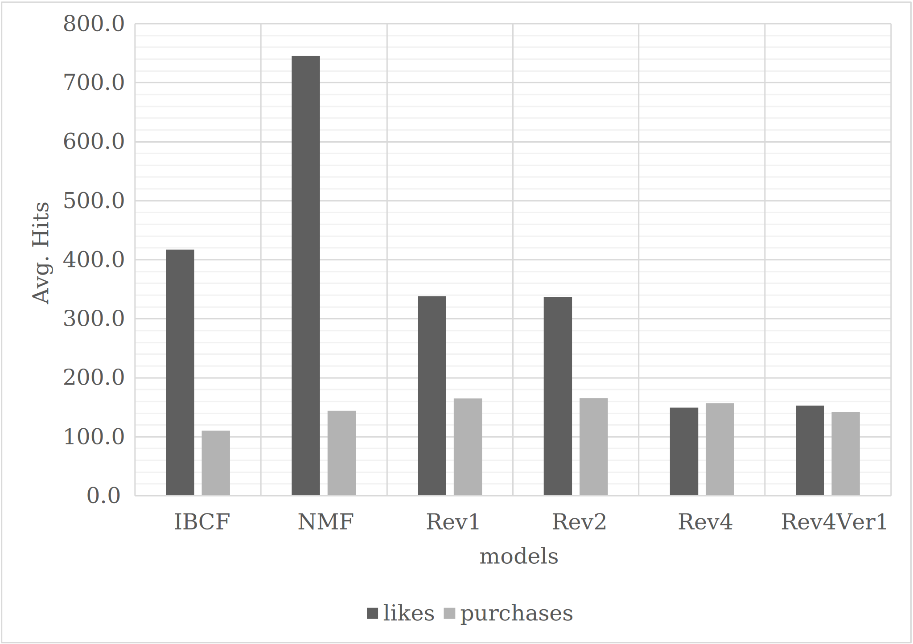
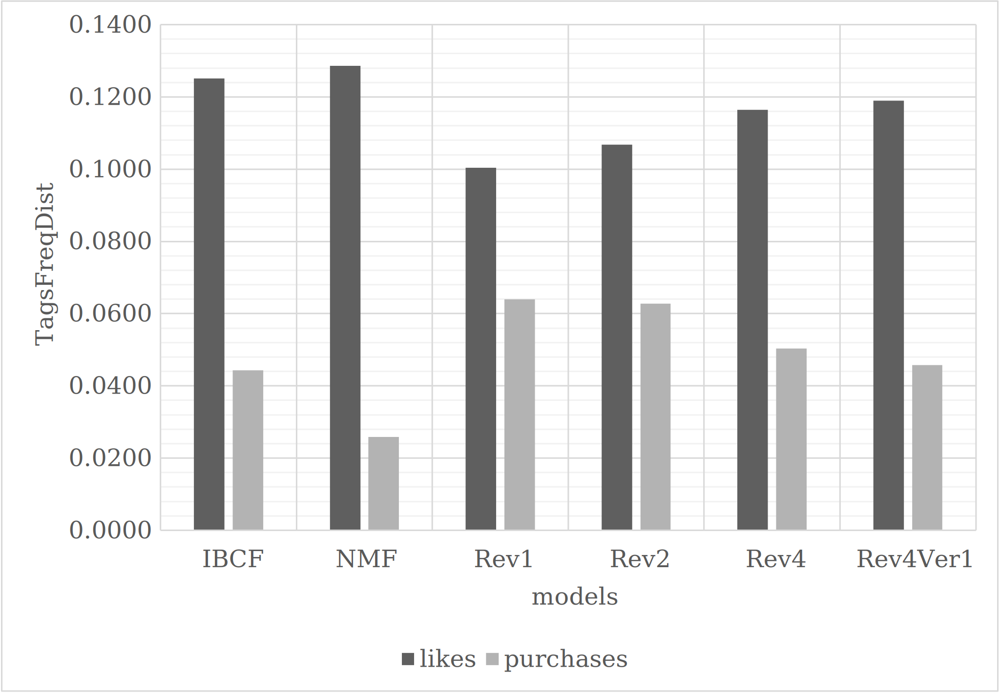

# Experiments

### Modules

|Methods|Models|Runners|Evaluations|
|:--:|:--:|:--:|:--:|
|Base|[IBCF](./related/ibcf.py)|[sh](./related/run_ibcf.sh)|[IRMetrics](./related/ibcf_results_summary.py)|
|Base|[NMF](./related/nmf.py)|[sh](./related/run_nmf.sh)|[IRMetrics](./related/nmf_results_summary.py)|
|Our|[Rev1](./our/rev1.py)|[sh](./our/run_rev1.sh)|[IRMetrics](./our/rev1_results_summary.py)|
|Our|[Rev2](./our/rev2.py)|[sh](./our/run_rev2.sh)|[IRMetrics](./our/rev2_results_summary.py)|
|Our|[Rev4](./our/rev4.py)|[sh](./our/run_rev4.sh)|[IRMetrics](./our/results_summary.py)|
|Our|[Rev4Ver1](./our/rev4v1.py)|[sh](./our/run_rev4ver1.sh)| N/A |

### Models parameters description

IBCF

- distance: Pearson correlation coefficient
- estimation: Adjusted weighted sum

NMF

- factorizer: $f=200, iter=200$
- estimator: $\lambda = 10^{-4}, \gamma = 10^{-5}, iter=150, L_{1}$-Norm
    - Seq.: $\tau^{\text{main}}=[V,L,P]$.

Rev1

- model: $NT(u)=10, \theta_{I}=10, \nu=0$
- estimator: $L_{1}$-Norm
    - Scores: $iter=10, \lambda=10^{-2}, \gamma=10^{-2}$
    - Weights: $iter=10, \lambda=10^{-2}, \gamma=10^{-2}$
    - Seq.: $\tau^{\text{main}}=[V,L,P]$.

Rev2

- model: $NT(u)=5, \theta_{I}=4, \nu=0$
- estimator: $L_{1}$-Norm
    - Scores: $iter=10, \lambda=10^{-2}, \gamma=10^{-4}$
    - Weights: $iter=5, \lambda=10^{-3}, \gamma=10^{0}$
    - Seq.: $\tau^{\text{main}}=[V,L,P]$.

Rev4

- estimator: $L_{1}$-Norm
    - Scores: $\lambda=10^{-2}, \gamma=10^{-4}$
    - Weights: $iter=5, \lambda=10^{-3}, \gamma=10^{0}$
    - Seq.: $\tau^{\text{main}}=[V,L,P], \tau^{\text{post}}=[V]$.

Rev4Ver1

- estimator: $L_{1}$-Norm
    - Scores: $\lambda=10^{-2}, \gamma=10^{-4}$
    - Weights: $iter=5, \lambda=10^{-3}, \gamma=10^{0}$
    - Seq.: $\tau^{\text{main}}=[V,L,P], \tau^{\text{post}}=[V]$.

### Results comparision
Benchmark models: IBCF, NMF, Rev1, Rev4Ver1.

Means

- $f_{1}$-scores

    

- No. of hits

    

 Top-N

- $f_{1}$-scores

    

    

- No. of hits

    

    

Tags distributions

Tags scores

