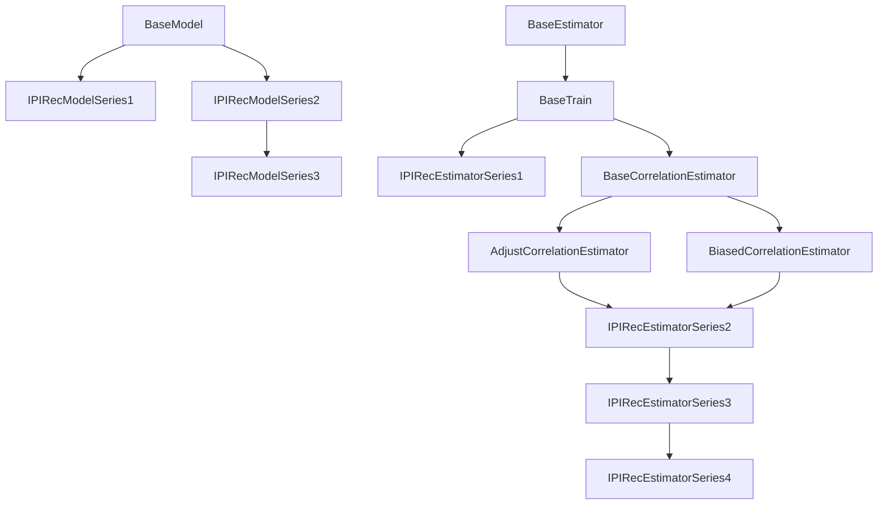

# IPIRec

요약:

- 의사결정 내역으로부터 태그들 간의 관계를 구하고, 이 관계를 사용해 항목의 선호도를 예측합니다.

- 태그 관계는 두 태그의 공통 발생성 $S$와 이에 대한 사용자들의 성향 $\Omega$로 표현됩니다.
    - 두 번째 개정안(Rev1, 2)까지는 두 태그관계를 $S$, 태그관계 $S$와 사용자들의 거리 $\Omega$의 의미를 갖습니다.

- 제안된 모델 개정 별 사용된 모듈구성은 다음과 같습니다.

|Label|Series|DataSet|Model|Estimator|Observ.| 
|--:|:--:|:--:|:--:|:--:|:--:|
|Rev1|Series1|ColleyDataSet [모듈](../colley/dataset/colley_dataset.py)|IPIRecModelSeries1 [모듈](./models/ipirec_model_series1.py), [설명](./models/model_rev_legacy.md)|IPIRecEstimatorSeries1 [모듈](./estimators/ipirec_estimator_series1.py), [설명](./estimators/estimator_rev1.md)|[ipynb](../ipynb/obs/rev1.ipynb)|
|Rev2|Series2|ColleyDataSet [모듈](../colley/dataset/colley_dataset.py)|IPIRecModelSeries2 [모듈](./models/ipirec_model_series2.py), [설명](./models/model_rev_legacy.md)|IPIRecEstimatorSeries2 [모듈](./estimators/ipirec_estimator_series2.py), [설명](./estimators/estimator_rev2.md)|[ipynb](../ipynb/obs/rev2.ipynb)|
|Rev4|Series3|ColleyDataSetRev [모듈](../colley/dataset/colley_dataset_rev.py)|IPIRecModelSeries3 [모듈](./models/ipirec_model_series3.py), [설명](./models/model_rev4.md)|IPIRecEstimatorSeries3 [모듈](./estimators/ipirec_estimator_series3.py), [설명](./estimators/estimator_rev4.md)|[ipynb](../ipynb/obs/rev4.ipynb)|
|Rev4(Ver1)|Series4|ColleyDataSetRev [모듈](../colley/dataset/colley_dataset_rev.py)|IPIRecModelSeries3 [모듈](./models/ipirec_model_series3.py), [설명](./models/model_rev4.md)|IPIRecEstimatorSeries4 [모듈](./estimators/ipirec_estimator_series4.py), [설명](./estimators/estimator_rev4.md)|[ipynb](../ipynb/obs/rev4v1.ipynb)|

- 훈련관련 사항들은 [이 문서](../assets/main.pdf)를 참고하세요.

## 모듈구성

<!-- 
## 모델구성
- IPIRec(Rev1): [IPIRecModelSeries1](./models/ipirec_model_series1.py)과 [IPIRecEstimatorSeries1](./estimators/ipirec_estimator_series1.py)로 구성됩니다.
    - IPIRecModelSeries1 [설명](./models/model_rev_legacy.md)
    - IPIRecEstimatorSeries1 [설명](./estimators/estimator_rev1.md)

- IPIRec(Rev2): [IPIRecModelSeries2](./models/ipirec_model_series2.py)와 [IPIRecEstimatorSeries2](./estimators/ipirec_estimator_series2.py)로 구성됩니다.
    - IPIRecModelSeries2 [설명](./models/model_rev_legacy.md)
    - IPIRecEstimatorSeries2 [설명](./estimators/estimator_rev2.md)

- IPIRec(Rev4): [IPIRecModelSeries3](./models/ipirec_model_series3.py)와 [IPIRecEstimatorSeries3](./estimators/ipirec_estimator_series3.py)로 구성됩니다.
    - IPIRecModelSeries3 [설명](./models/model_rev4.md)
    - IPIRecEstimatorSeries3 [설명](./estimators/estimator_rev4.md)

- IPIRec(Rev4Ver1): [IPIRecModelSeries3](./models/ipirec_model_series3.py)와 [IPIRecEstimatorSeries4](./estimators/ipirec_estimator_series4.py)로 구성됩니다.
    - IPIRecModelSeries3 [설명](./models/model_rev4.md)
    - IPIRecEstimatorSeries4 [설명](./estimators/estimator_rev4.md)

-->